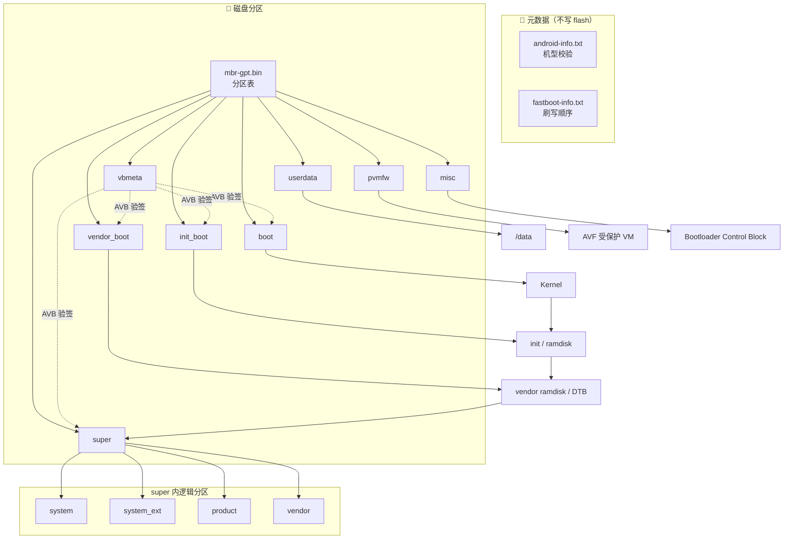
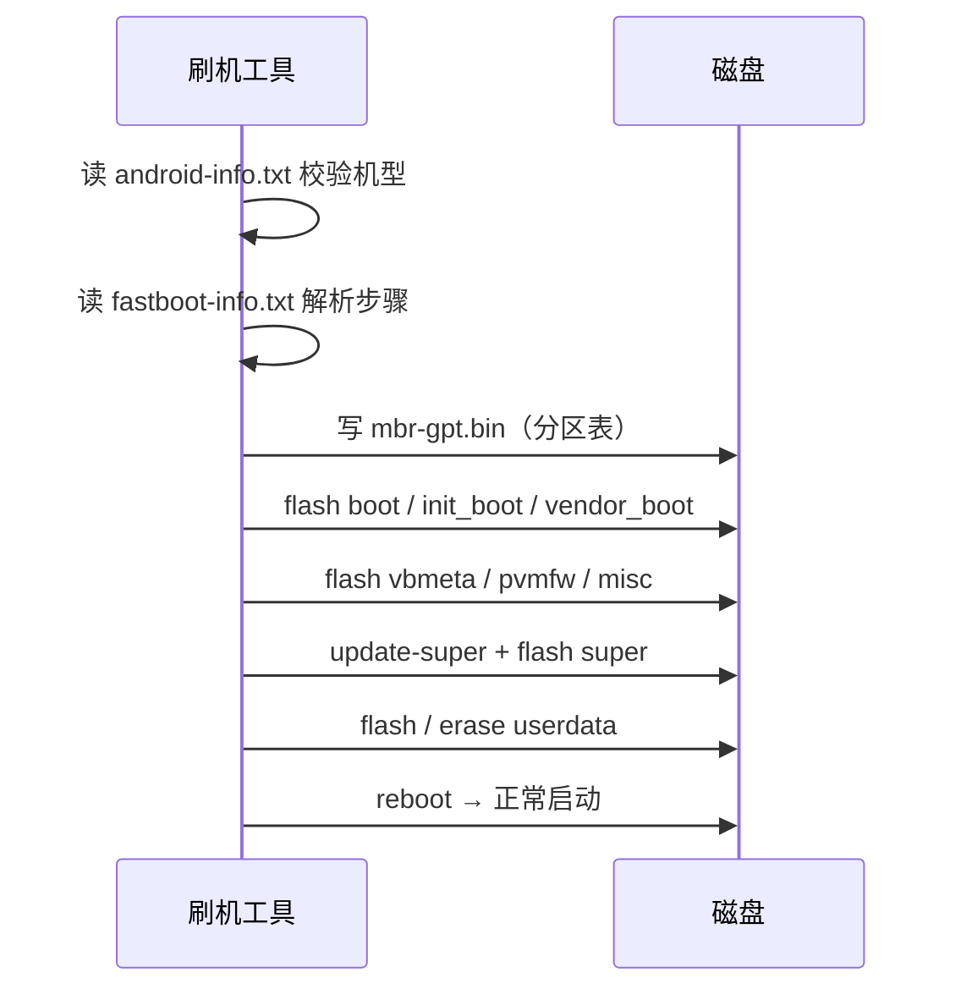

# Preflash 镜像分解说明

> 本文描述 Android **preflash.img** 解包后的文件结构、各区块含义，以及在磁盘上的分区落点。

---

## 1. 产物总览

解包 `preflash.img` 后通常得到如下文件：

```text
preflash.img
│
├── 📄 元数据（不落分区）
│   ├── android-info.txt
│   └── fastboot-info.txt
│
└── 💾 镜像（写入磁盘）
    ├── mbr-gpt.bin      ← 分区表
    ├── boot.img         ← boot
    ├── init_boot.img    ← init_boot
    ├── vendor_boot.img  ← vendor_boot
    ├── vbmeta.img       ← vbmeta
    ├── pvmfw.img        ← pvmfw
    ├── misc.img         ← misc
    ├── super.img        ← super（动态分区容器）
    └── userdata.img     ← userdata
```

| 文件 | 类型 | 对应分区 | 作用摘要 |
|:-----|:----:|:--------:|:---------|
| `android-info.txt` | 元数据 | — | 机型 / 版本校验 |
| `fastboot-info.txt` | 元数据 | — | 刷写顺序与参数 |
| `mbr-gpt.bin` | 分区表 | 整盘 LBA 0 起 | MBR + GPT 布局 |
| `boot.img` | 启动 | `boot` | 内核 (kernel) |
| `init_boot.img` | 启动 | `init_boot` | 通用 ramdisk / init |
| `vendor_boot.img` | 启动 | `vendor_boot` | 厂商 ramdisk、DTB、cmdline |
| `vbmeta.img` | 安全 | `vbmeta` | AVB 验签元数据 |
| `pvmfw.img` | 安全 / 虚拟化 | `pvmfw` | 受保护虚拟机固件 |
| `misc.img` | 控制 | `misc` | BCB 启动 / recovery 控制块 |
| `super.img` | 系统 | `super` | system / vendor / product 等 |
| `userdata.img` | 数据 | `userdata` | `/data` 初始内容 |

---

## 2. 磁盘布局（逻辑视图）

```text
┌──────────────────────────────────────────────────────────────────┐
│                        物 理 磁 盘                                │
├──────────────────────────────────────────────────────────────────┤
│  mbr-gpt.bin                                                     │
│  ┌─────────┬──────────────────────────────────────────────────┐  │
│  │Protective│              GPT Header + Entries               │  │
│  │  MBR     │         （定义下列各分区起止 LBA）                 │  │
│  └─────────┴──────────────────────────────────────────────────┘  │
├──────────┬───────────────────────────────────────────────────────┤
│  boot    │  boot.img          内核                               │
├──────────┼───────────────────────────────────────────────────────┤
│init_boot │  init_boot.img     通用 init / ramdisk                │
├──────────┼───────────────────────────────────────────────────────┤
│vendor_boot│ vendor_boot.img   厂商启动数据                        │
├──────────┼───────────────────────────────────────────────────────┤
│  vbmeta  │  vbmeta.img        AVB 验签                           │
├──────────┼───────────────────────────────────────────────────────┤
│  pvmfw   │  pvmfw.img         Protected VM Firmware              │
├──────────┼───────────────────────────────────────────────────────┤
│  misc    │  misc.img          BCB / 启动控制                      │
├──────────┼───────────────────────────────────────────────────────┤
│  super   │  super.img  ──┐                                       │
│          │               │  动态逻辑分区（见下节）                  │
│          │               ▼                                       │
│          │  ┌─────────┬──────────┬─────────┬────────┬─────┐     │
│          │  │ system  │system_ext│ product │ vendor │ …   │     │
│          │  └─────────┴──────────┴─────────┴────────┴─────┘     │
├──────────┼───────────────────────────────────────────────────────┤
│ userdata │  userdata.img      → 挂载为 /data                     │
└──────────┴───────────────────────────────────────────────────────┘
```

> **A/B 设备**：`boot` / `init_boot` / `vendor_boot` / `vbmeta` 以及 super 内逻辑分区常有 `_a` / `_b` 槽位；上表按逻辑名书写。

---

## 3. Super 内部结构

`super.img` 是 **物理容器**，不是单一文件系统。刷入 `super` 分区后，由逻辑分区元数据映射出各只读分区：

```text
super.img
│
├── system          →  /system
├── system_ext      →  /system_ext
├── product         →  /product
├── vendor          →  /vendor
├── vendor_dlkm     →  (可加载内核模块，若启用)
├── system_dlkm     →  (可加载内核模块，若启用)
├── odm             →  /odm          （若有）
└── odm_dlkm        →  （若有）
```

| 逻辑分区 | 运行时挂载点 | 典型内容 |
|:---------|:-------------|:---------|
| `system` | `/system` | 框架、系统 App、核心库 |
| `system_ext` | `/system_ext` | 系统扩展组件 |
| `product` | `/product` | 产品线定制 |
| `vendor` | `/vendor` | HAL、厂商用户态、驱动配套 |
| `vendor_dlkm` / `system_dlkm` | 模块路径 | 可动态加载的 `.ko` |
| `odm` | `/odm` | ODM / 板级定制 |

可用工具查看：

```bash
lpunpack super.img out_dir/    # 拆出各逻辑分区镜像
lpdump  super.img              # 打印动态分区元数据
```

---

## 4. 启动与挂载关系



### 冷启动简化路径

```text
Bootloader
    │
    ├─ 读 misc        → 是否进 recovery / fastboot
    ├─ 读 vbmeta      → 校验后续镜像
    ├─ 加载 boot      → Kernel
    ├─ 加载 init_boot → 通用 ramdisk
    ├─ 加载 vendor_boot → 设备相关启动参数
    │
    ├─ 映射 super     → system / vendor / product / …
    └─ 挂载 userdata  → /data
         │
         ▼
      Android 用户空间
```

---

## 5. 分文件详解

### 5.1 元数据

| 文件 | 落点 | 说明 |
|:-----|:----:|:-----|
| **android-info.txt** | 不写盘 | 描述目标 board、bootloader 版本等；刷机前匹配设备，防刷错机型 |
| **fastboot-info.txt** | 不写盘 | 声明式刷写步骤：`flash boot`、`update-super`、`flash super`、`erase userdata` 等 |

### 5.2 分区表

| 文件 | 落点 | 说明 |
|:-----|:----:|:-----|
| **mbr-gpt.bin** | 磁盘起始扇区 | Protective MBR + GPT；定义各 Android 分区名字与 LBA 范围。Desktop / PC 形态 preflash 常见先写此文件再建分区内容 |

### 5.3 启动链

| 文件 | 分区名 | by-name 示例 | 说明 |
|:-----|:------:|:-------------|:-----|
| **boot.img** | `boot` | `/dev/block/by-name/boot` | Linux 内核；GKI 时代 ramdisk 多已拆出 |
| **init_boot.img** | `init_boot` | `/dev/block/by-name/init_boot` | 通用 ramdisk 与 `init`，与 kernel 解耦便于独立更新 |
| **vendor_boot.img** | `vendor_boot` | `/dev/block/by-name/vendor_boot` | 厂商 ramdisk、DTB、bootconfig / cmdline |

### 5.4 安全与控制

| 文件 | 分区名 | by-name 示例 | 说明 |
|:-----|:------:|:-------------|:-----|
| **vbmeta.img** | `vbmeta` | `/dev/block/by-name/vbmeta` | AVB 哈希树 / 描述符；保障 boot、super 等未被篡改 |
| **pvmfw.img** | `pvmfw` | `/dev/block/by-name/pvmfw` | Protected Virtual Machine Firmware；供 AVF 受保护虚拟机使用 |
| **misc.img** | `misc` | `/dev/block/by-name/misc` | BCB 等控制数据；指示下次启动模式，preflash 常给干净初始值 |

### 5.5 系统与用户数据

| 文件 | 分区名 | by-name 示例 | 说明 |
|:-----|:------:|:-------------|:-----|
| **super.img** | `super` | `/dev/block/by-name/super` | 动态分区容器；内含 system / vendor / product 等逻辑分区 |
| **userdata.img** | `userdata` | `/dev/block/by-name/userdata` | 用户数据区，挂载为 `/data`；工厂预刷或出厂空数据 |

---

## 6. 运行时路径对照

| 你关心的内容 | 主要来源镜像 | 分区 / 挂载 |
|:-------------|:-------------|:------------|
| 内核 | `boot.img` | `boot` |
| 早期 init | `init_boot.img` + `vendor_boot.img` | `init_boot` / `vendor_boot` |
| `/system` | `super.img` → `system` | mapper → `/system` |
| `/vendor` | `super.img` → `vendor` | mapper → `/vendor` |
| `/product` | `super.img` → `product` | mapper → `/product` |
| `/data` | `userdata.img` | `userdata` → `/data` |
| 验签 / 防回滚 | `vbmeta.img` | `vbmeta` |
| recovery 控制字 | `misc.img` | `misc` |
| 受保护 VM | `pvmfw.img` | `pvmfw` |
| 整盘长什么样 | `mbr-gpt.bin` | 分区表（非数据分区） |

---

## 7. 典型刷写顺序

实际顺序以包内 **`fastboot-info.txt`** 为准，常见逻辑如下：

```text
① 校验 android-info.txt（机型匹配）
② 写入 mbr-gpt.bin          → 建立分区表
③ flash boot / init_boot / vendor_boot
④ flash vbmeta （及 --apply-vbmeta 等参数）
⑤ flash pvmfw / misc
⑥ update-super + flash super
⑦ flash userdata（或 if-wipe erase userdata）
⑧ reboot
```



---

## 8. 本包未包含、但设备上常见的分区

下列分区**不一定**出现在 preflash 解包列表中，却常在 GPT 中存在：

| 分区 | 常见用途 |
|:-----|:---------|
| `metadata` | 文件级加密 / 元数据 |
| `persist` | 持久化校准、传感器数据等 |
| `frp` | Factory Reset Protection |
| `esp` | x86 Desktop EFI 系统分区 |
| `bootloader` / 固件区 | 由 SoC / BIOS 管理，未必随 preflash 下发 |
| `*_b` 槽位 | A/B 无缝更新的 B 槽 |

---

## 9. 速查卡片

```text
┌──────────────┬─────────────┬────────────────────────────┐
│ 文件         │ 分区        │ 一句话                      │
├──────────────┼─────────────┼────────────────────────────┤
│ android-info │ —           │ 刷对机型                    │
│ fastboot-info│ —           │ 刷写剧本                    │
│ mbr-gpt.bin  │ 分区表      │ 磁盘长什么样                │
│ boot.img     │ boot        │ 内核                        │
│ init_boot    │ init_boot   │ 通用 init                   │
│ vendor_boot  │ vendor_boot │ 厂商启动数据                │
│ vbmeta.img   │ vbmeta      │ 验签                        │
│ pvmfw.img    │ pvmfw       │ 受保护 VM 固件              │
│ misc.img     │ misc        │ 下次启动去哪                │
│ super.img    │ super       │ 系统全家桶容器              │
│ userdata.img │ userdata    │ /data                       │
└──────────────┴─────────────┴────────────────────────────┘
```

---

*文档对应 preflash 解包产物：*  
`android-info.txt` · `boot.img` · `fastboot-info.txt` · `init_boot.img` · `mbr-gpt.bin` · `misc.img` · `pvmfw.img` · `super.img` · `userdata.img` · `vbmeta.img` · `vendor_boot.img`
